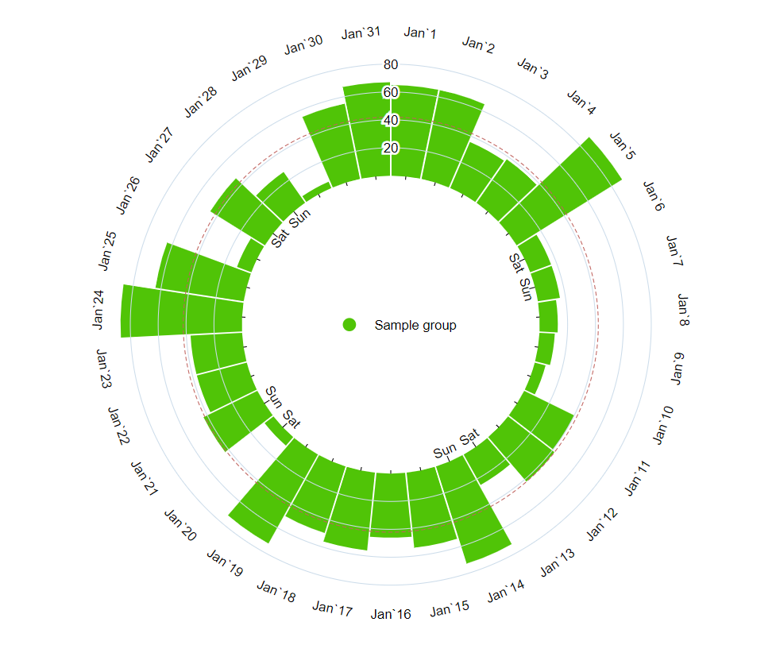

# ngx-polar-chart

Polar chart based on d3 library for Angular

Before start please proceed the [documentation](https://vanavaravl.github.io/ngx-polar-chart/installation) of the library.<br> 

All features and autogenerated sample data sets are available at [demo page](https://vanavaravl.github.io/ngx-polar-chart) of application.

Angular version is used: [version 14.2.0]
## Features

### Chart Types

- Grouped<br>
Some examples:<br>



- Stacked<br>
Some examples:<br>


### Displaying

Both of chart types support custom displaying by date, month and year in case of Date-type.

## Install

To use ngx-polar-chart in your project install it via [npm](https://www.npmjs.com/package/@vanavara/ngx-polar-chart):

```powerShell
npm install @vanavara/ngx-polar-chart --save
```

Provide information about installed library module in the AppModule of your application:

```typescript
import {NgxPolarChartModule} from 'NgxPolarChart';

@NgModule({
  declarations: [],
  imports: [NgxPolarChartModule],
  providers: [],
  bootstrap: [AppComponent],
})
export class AppModule {}
```


## Use chart components in the application

Use component for group polar chart in your template:

```html
<ngx-polar-chart-group [chartData]="sampleDataSet"></ngx-polar-chart-group>
```

Use component for stack polar chart in your template:

```html
<ngx-polar-chart-stack [chartData]="sampleDataSet"></ngx-polar-chart-stack>
```

## [chartSettings] overview

```html
<ngx-polar-chart-group [chartSettings]="settingsSample"></ngx-polar-chart-group>

<ngx-polar-chart-stack [chartSettings]="settingsSample"></ngx-polar-chart-stack>
```

Chart settings is a type in the library: 
```typescript
export interface NgxPolarChartSettings {
  width?: number;
  height?: number;
  fontSettings?: NgxPolarChartFontSettings;
  showToolTip?: boolean;
  barsSettings?: NgxPolarChartBarSettings;
  labelSettings?: NgxPolarChartLabelSettings;
  tickSettings?: NgxPolarChartTickSettings;
  showLegend?: boolean;
  locale?: string;
}
```

More info can be found [here](https://vanavaravl.github.io/ngx-polar-chart/settings).

If chart settings is null then default settings will be applied. By default it means:
- Always show tool tip with value of certain item in the group
- Always highlight average, maximum and minimum values on the chart
- Always auto generate colors in hex format for each group
- In case of NgxDateGroup (we work with dates and display by day of month) always show weekends of certain month

All parameters are optional. And if chart settings is not null then nullable parameters will be overriden by default values

## Displaying data set on the chart in case of Date type
Just use `NgxGroupBy` enum in `NgxDateGroup`.
```typescript
export interface NgxDateGroup {
  groups: NgxGroups<Date>[];
  groupBy?: NgxGroupBy;
}
```

## Localization of chart in case of Date type
In the chart settings ([chartSettings]) the parameter will have to be specified:
```typescript
export interface NgxPolarChartSettings {
  locale?: string;
}
```

## Dependencies
The library depends on the following packages:
- d3 [version 7.8.5]
- lodash [version 4.17.21]
- moment [version 2.30.1]

## License
[MIT](https://github.com/vanavaraVL/ngx-polar-chart?tab=MIT-1-ov-file#readme) License © 2024 vanavaraVL
